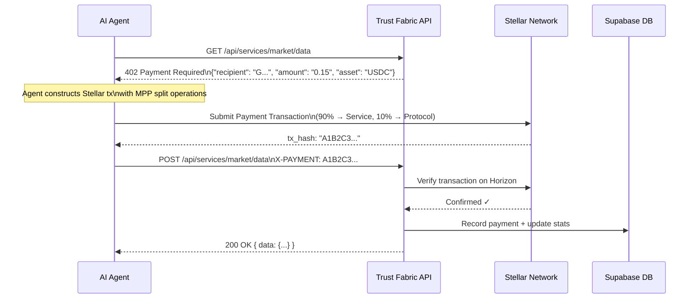
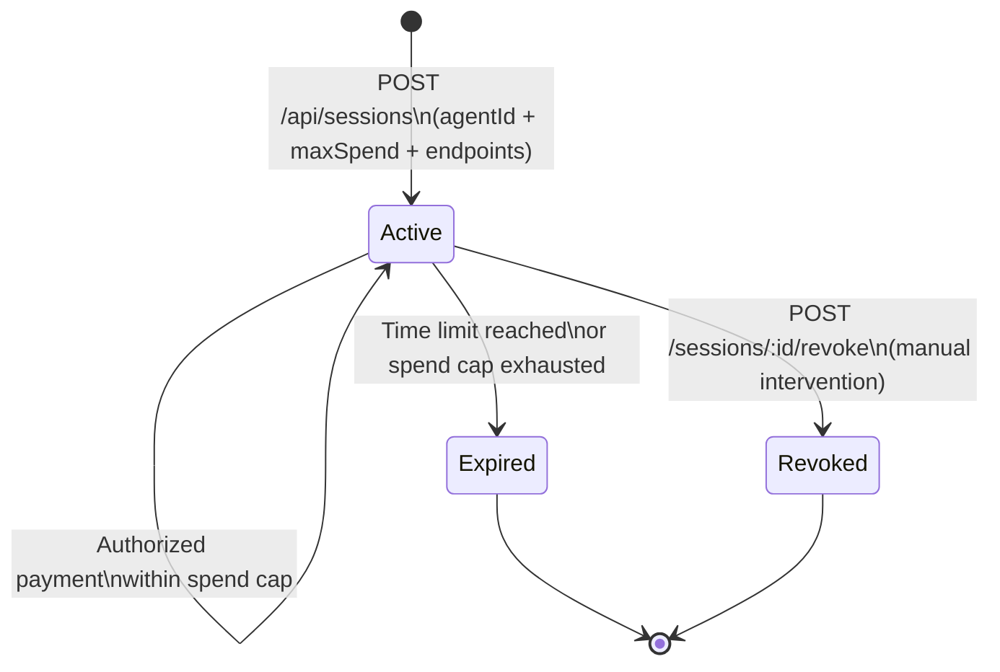
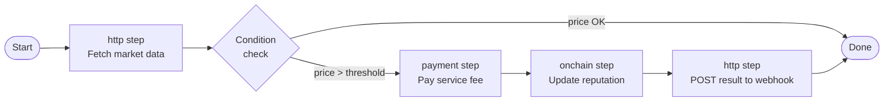

# Stellar Agent Trust Fabric

> A decentralized trust and micropayment infrastructure for autonomous AI agents on the Stellar network.
> Built for the **Stellar Agents x402 Hackathon**.

---

## What Is It?

Stellar Agent Trust Fabric is a middleware layer that lets AI agents discover, pay for, and rate services using native Stellar micropayments — with no custodians, no API keys to share, and no trust required. Every payment is a real Stellar transaction. Every reputation score is earned on-chain.

---

## Architecture Overview

```
┌─────────────────────────────────────────────────────────────────┐
│                         AI Agent (any LLM)                      │
│          Claude · GPT-4 · Cursor · Custom MCP Client            │
└───────────────────────────────┬─────────────────────────────────┘
                                │  HTTP + X-PAYMENT header (x402)
                                ▼
┌─────────────────────────────────────────────────────────────────┐
│                    Trust Fabric API Server                       │
│                     (Node.js / Express)                         │
│                                                                  │
│  ┌────────────────┐  ┌──────────────┐  ┌─────────────────────┐ │
│  │  x402 Middleware│  │  MCP Server  │  │   Workflow Engine   │ │
│  │  Payment Verify │  │  (SSE/Tools) │  │  (HTTP/Pay/Chain)   │ │
│  └────────────────┘  └──────────────┘  └─────────────────────┘ │
│                                                                  │
│  ┌────────────┐  ┌──────────┐  ┌───────────┐  ┌────────────┐  │
│  │  Agents    │  │ Services │  │  Sessions  │  │  Payments  │  │
│  │  Registry  │  │Marketplace│  │  Manager  │  │   Ledger   │  │
│  └────────────┘  └──────────┘  └───────────┘  └────────────┘  │
└────────────┬────────────────────────────────────────┬───────────┘
             │                                        │
             ▼                                        ▼
┌────────────────────────┐              ┌─────────────────────────┐
│  Soroban Smart Contracts│              │     Stellar Horizon      │
│                         │              │    (Testnet / Mainnet)   │
│  ┌──────────────────┐  │              │                          │
│  │  Reputation.wasm │  │              │  ✓ tx verification        │
│  │  Registry.wasm   │  │              │  ✓ balance lookups        │
│  │  SessionPolicy.wasm│              │  ✓ DEX path payments      │
│  └──────────────────┘  │              │  ✓ Friendbot funding      │
└────────────────────────┘              └─────────────────────────┘
             │
             ▼
┌────────────────────────┐
│  Supabase PostgreSQL   │
│  (EU West 1)           │
│                        │
│  agents · services     │
│  sessions · payments   │
│  ratings · workflows   │
└────────────────────────┘
```

---

## x402 Payment Flow

The x402 protocol turns HTTP 402 "Payment Required" into a machine-readable payment challenge. Agents can discover, pay, and retry — all programmatically.



---

## MPP Split Payment

Every service payment is automatically split at the protocol level using Stellar's multi-operation transaction support:

```
┌────────────────────────────────────────────────────────┐
│              Single Stellar Transaction                 │
│                                                        │
│   Operation 1: Payment                                 │
│   ├─ To:     Service Owner Address                     │
│   ├─ Amount: 0.135 USDC  (90%)                        │
│   └─ Asset:  USDC (Circle)                            │
│                                                        │
│   Operation 2: Payment                                 │
│   ├─ To:     Protocol Fee Address (Admin)              │
│   ├─ Amount: 0.015 USDC  (10%)                        │
│   └─ Asset:  USDC (Circle)                            │
│                                                        │
│   Either both succeed or the entire tx is rejected.   │
└────────────────────────────────────────────────────────┘
```

---

## Session-Based Access Control

Agents can operate under a scoped session with a spend cap and endpoint whitelist — ideal for autonomous workflows that should not exceed a budget.



**Session object:**
```json
{
  "sessionToken": "stf_6e2eb54e6dfa816dd95e75ed1035932e2e79c979e6bc0e7c",
  "maxSpendUsdc": 5.00,
  "spentUsdc": 0.00,
  "allowedEndpoints": ["/api/services/market/data", "/api/services/sentiment"],
  "expiresAt": "2026-04-13T15:00:00Z",
  "status": "active"
}
```

---

## Soroban Smart Contracts

Three Rust/Soroban contracts enforce the on-chain trust layer:

```
contracts/
├── reputation/        # On-chain agent/service scoring
│   └── src/lib.rs     # update_score(), get_score(), weighted avg
├── registry/          # Decentralized service directory
│   └── src/lib.rs     # register(), deregister(), lookup()
└── session-policy/    # Spend enforcement + expiry
    └── src/lib.rs     # set_policy(), check_allowed(), revoke()
```

| Contract | Address | Purpose |
|---|---|---|
| `reputation` | `[CDG7G7MBLWLG3FD3YPMVGCFWB4HCF7PWSX2VIOHIAUVBJ23QQAMSPPHA](https://stellar.expert/explorer/testnet/contract/CDG7G7MBLWLG3FD3YPMVGCFWB4HCF7PWSX2VIOHIAUVBJ23QQAMSPPHA).` | Agent & service reputation scoring |
| `registry` | `https://stellar.expert/explorer/testnet/contract/CAXV62IIEHBEPRNKZXYNEITMENNSX6U5Y7VT36N4XLI63ZNPCC73CRQ6` | Service provider directory |
| `session-policy` | `https://stellar.expert/explorer/testnet/contract/CAKSBWFSRPCBN6XHV5PUOVHU5234CHOGZNXKLXBOAUW4RZCIL45RU2F7` | Budget caps + endpoint whitelists |

---

## Paid Service Marketplace

Five real services are available via x402 payment:

| Service | Endpoint | Price | Data Source |
|---|---|---|---|
| Market Data Feed | `POST /api/services/market/data` | 0.15 USDC | CoinGecko + Horizon DEX |
| Web Scraper Pro | `POST /api/services/scraper` | 0.10 USDC | Live HTML fetch |
| Soroban Auditor | `POST /api/services/audit` | 0.25 USDC | Rust pattern analysis |
| Stellar Pathfinder | `POST /api/services/pathfinder` | 0.05 USDC | Horizon path API |
| Sentiment Oracle | `POST /api/services/sentiment` | 0.05 USDC | Keyword scoring |

Each service returns a `402` on `GET` with the payment spec, and returns data on `POST` with a valid `X-PAYMENT` header.

---

## MCP Server

The Model Context Protocol server exposes Trust Fabric as a toolbox for any MCP-compatible AI client (Claude, Cursor, etc.):

```
GET  /api/mcp/info      → Server metadata & available tools
POST /api/mcp/message   → Tool invocation endpoint (SSE)
```

**Tools exposed:**

| Tool | Description |
|---|---|
| `list_services` | Browse the service marketplace |
| `summarize_text` | Pay-per-use AI text summarizer |
| `execute_workflow` | Run a multi-step agent workflow |
| `get_agent_reputation` | Fetch on-chain reputation score |
| `create_account` | Fund a new Stellar testnet account |

If `STELLAR_SECRET` is set in the MCP environment, the server auto-signs x402 payments on behalf of the agent.

---

## Workflow Engine

Orchestrate multi-step agent tasks combining HTTP calls, Stellar payments, and on-chain contract interactions:



**Step types:**

```json
{
  "steps": [
    { "type": "http",    "url": "{{API_BASE}}/services/market/data", "method": "POST" },
    { "type": "payment", "to": "G...", "amount": "0.10", "asset": "USDC" },
    { "type": "onchain", "contract": "CAXV62II...", "fn": "update_score" }
  ]
}
```

Steps can reference outputs from previous steps using `{{variable}}` interpolation.

---

## Pay Links

Shareable URLs that pre-fill a Stellar payment intent — no wallet app required on the sender side:

```
/pay?to=GDUQ244U...&amount=1.00&asset=USDC&memo=invoice-42
```

The Trust Fabric frontend renders a QR code + deep-link button compatible with any Stellar wallet (Lobstr, Solar, LOBSTR).

---

## Monorepo Structure

```
stellar-agent-trust-fabric/
│
├── artifacts/
│   ├── api-server/              # Express backend (Node.js)
│   │   └── src/
│   │       ├── routes/          # agents, services, sessions, payments,
│   │       │                    # proxies, workflows, mcp, pay, stellar
│   │       └── lib/
│   │           ├── x402Middleware.ts   # 402 challenge + verification
│   │           ├── stellarPayments.ts  # MPP split, tx builder
│   │           └── soroban.ts          # Contract invocations
│   │
│   └── trust-fabric/            # React + Vite frontend
│       └── src/
│           └── pages/
│               ├── dashboard/   # Network stats overview
│               ├── agents/      # Reputation leaderboard + detail
│               ├── sessions/    # Session manager
│               ├── payments/    # Payment ledger
│               ├── services/    # Marketplace
│               ├── explore/     # API browser
│               ├── demo/        # Interactive demo lab
│               ├── stellar/     # Stellar utilities lab
│               ├── mcp/         # MCP server config
│               ├── pay/         # Pay link generator
│               └── workflows/   # Workflow builder
│
├── contracts/
│   ├── reputation/              # Soroban (Rust) — scoring
│   ├── registry/                # Soroban (Rust) — service directory
│   └── session-policy/          # Soroban (Rust) — spend enforcement
│
└── lib/
    ├── api-spec/                # OpenAPI 3.1 (single source of truth)
    ├── api-zod/                 # Zod schemas (generated)
    ├── api-client-react/        # React Query hooks (generated)
    └── db/                      # Drizzle ORM + Supabase schema
        └── src/schema/
            ├── agents.ts
            ├── services.ts
            ├── sessions.ts
            ├── payments.ts
            ├── ratings.ts
            └── workflows.ts
```

---

## Database Schema

```
agents
  id · name · stellarAddress · reputationScore
  totalSpentUsdc · totalEarnedUsdc · txCount
  createdAt

services
  id · name · description · endpoint · priceUsdc
  ownerAddress · category · reputationScore
  totalRequests · createdAt

sessions
  id · agentId → agents · sessionToken
  maxSpendUsdc · spentUsdc · allowedEndpoints[]
  expiresAt · status (active|expired|revoked) · createdAt

payments
  id · agentId → agents · serviceId → services
  txHash · amountUsdc · status (confirmed|pending|failed)
  fromAddress · toAddress · createdAt

ratings
  id · agentId → agents · serviceId → services
  paymentId → payments · score (1-5) · comment · createdAt

workflows
  id · name · agentId → agents · steps (JSON)
  status · createdAt

workflow_executions
  id · workflowId → workflows · status
  startedAt · completedAt · result (JSON)
```

---

## Tech Stack

| Layer | Technology |
|---|---|
| Smart Contracts | Rust + Soroban SDK (Stellar) |
| Backend | Node.js · Express · TypeScript |
| Payment Protocol | x402 (HTTP 402 native) |
| Stellar SDK | `@stellar/stellar-sdk` |
| Database | Supabase (PostgreSQL) + Drizzle ORM |
| Frontend | React 18 + Vite + TailwindCSS |
| UI Components | shadcn/ui + Recharts |
| API Contract | OpenAPI 3.1 → Zod → React Query (codegen) |
| AI Protocol | Model Context Protocol (MCP) |
| Package Manager | pnpm workspaces (monorepo) |
| Network | Stellar Testnet (Friendbot-funded) |

---

## Quick Start

### Prerequisites

- Node.js 20+
- pnpm 9+
- A Stellar testnet keypair ([Stellar Laboratory](https://laboratory.stellar.org))
- Supabase project with the schema applied

### Environment Variables

Copy `.env.example` to `.env` and fill in your values:

```bash
cp .env.example .env
```

Key variables:

| Variable | Required | Description |
|---|---|---|
| `SUPABASE_DATABASE_URL` | Yes | Supabase PostgreSQL connection string |
| `SESSION_SECRET` | Yes | Random string for cookie signing (min 32 chars) |
| `DEMO_AGENT_SECRET` | Yes | Stellar secret key for the demo wallet |
| `STELLAR_FAUCET_SECRET` | Yes | Secret key of the USDC issuer/faucet account |
| `SOROBAN_ADMIN_SECRET` | Yes | Admin keypair for Soroban contract invocations |
| `STELLAR_VERIFY_ONCHAIN` | No | `"true"` to verify payments on Horizon; omit for dev mode |

### Run Locally

```bash
pnpm install

# Start the API server (port 8080)
pnpm --filter @workspace/api-server run dev

# Start the frontend (port 3000)
pnpm --filter @workspace/trust-fabric run dev
```

### Test an x402 Payment (dev mode)

```bash
# 1. Get the 402 challenge
curl http://localhost:8080/api/services/market/data

# 2. Call with a 64-char hex payment hash (dev mode skips on-chain check)
curl -X POST http://localhost:8080/api/services/market/data \
  -H "X-PAYMENT: A1B2C3D4E5F6789012345678901234567890ABCDEF0123456789ABCDEF012345"
```

---

## Deploy to Render

The project ships with a `render.yaml` Blueprint for one-click deployment as a single Web Service (API + frontend bundled together).

### Steps

**1. Push to GitHub**

```bash
git init
git add .
git commit -m "Initial commit"
git remote add origin https://github.com/<you>/stellar-agent-trust-fabric.git
git push -u origin main
```

**2. Create Render service**

- Go to [render.com](https://render.com) → **New** → **Blueprint**
- Connect your GitHub repo
- Render reads `render.yaml` automatically and configures the service

**3. Set secret environment variables**

In the Render dashboard → your service → **Environment**, add:

| Variable | Value |
|---|---|
| `SUPABASE_DATABASE_URL` | Your Supabase connection string |
| `DEMO_AGENT_SECRET` | Stellar secret key of the demo wallet |
| `STELLAR_FAUCET_SECRET` | Stellar secret key of the USDC faucet |
| `SOROBAN_ADMIN_SECRET` | Admin keypair for Soroban |

All other variables (contract IDs, addresses, `STELLAR_VERIFY_ONCHAIN`) are pre-configured in `render.yaml`.

**4. Deploy**

Render builds and starts the service automatically. The API serves the React dashboard as static files — no separate frontend deployment needed.

```
https://stellar-agent-trust-fabric.onrender.com/       → Dashboard (React)
https://stellar-agent-trust-fabric.onrender.com/api/   → REST API
```

### Build Process (what Render runs)

```bash
# 1. Install all workspace dependencies
pnpm install --frozen-lockfile

# 2. Build React frontend → artifacts/trust-fabric/dist/public/
# (shared libs have no separate build step — bundled directly by Vite/esbuild)
BASE_PATH=/ pnpm --filter @workspace/trust-fabric run build

# 3. Bundle API server → artifacts/api-server/dist/
# (also bundles lib/db, lib/api-zod, lib/api-client-react via esbuild)
pnpm --filter @workspace/api-server run build

# 4. Start (API also serves frontend static files in NODE_ENV=production)
pnpm --filter @workspace/api-server run start
```

---

## How Reputation Works

Agents and services both accumulate reputation scores on a 0–10 scale, written to the Soroban `reputation` contract after each rated interaction:

```
new_score = (old_score × tx_count + new_rating) / (tx_count + 1)
```

Ratings are submitted via `POST /api/ratings` and require a linked payment hash, preventing fake reviews. The leaderboard on the Agents page is sorted by weighted reputation × volume.

---

## Hackathon Highlights

- **Real x402 payments** — not mocked; every service call deducts from a Stellar testnet account
- **On-chain reputation** — Soroban contract enforces scoring, not just a database field
- **MPP split** — 90/10 fee split in a single atomic transaction
- **MCP integration** — plug directly into Claude or any MCP-compatible agent framework
- **Session scoping** — budget-capped agent sessions enforced on-chain via `session-policy` contract
- **Live marketplace** — 5 real data services backed by CoinGecko, Horizon, and live web scraping
- **Full monorepo** — OpenAPI → Zod → React Query codegen keeps backend and frontend in sync automatically
